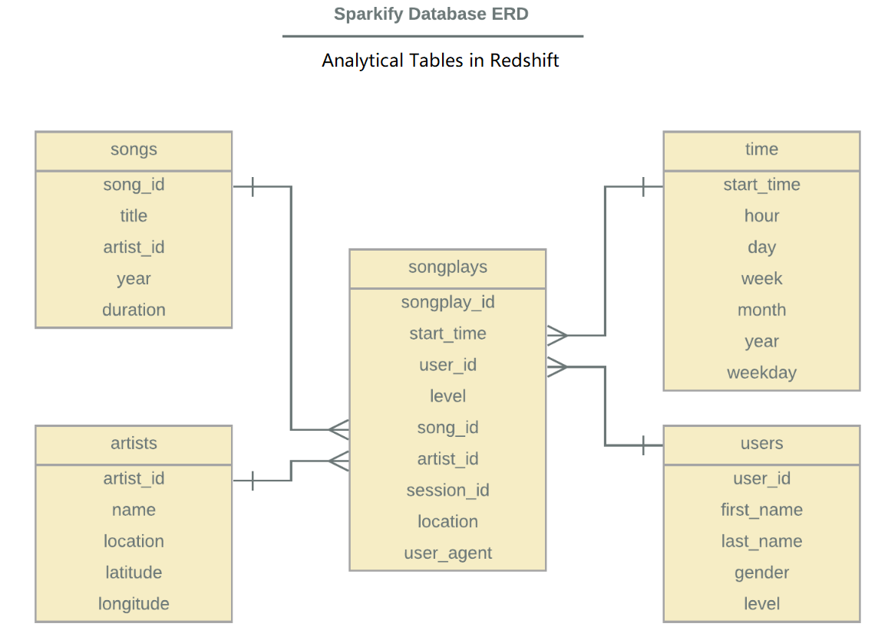

# Music Streaming App Data Warehouse on AWS

## Introduction
**Sparkify** is a startup which provides music streaming service. Their user actitvity data and songs information are origianlly stored in JSON files in Amazon S3 buckets. This project is to create data warehouse for thier data with Amazon Redshift and perfrom ETL to store data into analytical tables. In that case, queries can be easily performed by analytical team. They are mainly insterested in users' activity pattern.

## Data set
JSON files in S3 buckets

## Workflow
1. Two staging tables and five analytical tables in dimensional model are created in Redshift. 
2. Data in S3 are first copied to staging tables as intergrated sources: staging_events and staging_songs.
3. Insert data into five analytical tables from staging tables directly.

## Dimensional model schema

## Staging tables
- staging_events: store log data from data source
- staging_songs: store song data from data source

## Fact table
- songplays:records associated with song plays 
songplay_id, start_time, user_id, level, song_id, artist_id, session_id, location, user_agent
## Dimesion tables
- users:users in the app
(user_id, first_name, last_name, gender, level)
- songs:songs in music database
(song_id, title, artist_id, year, duration)
- aritists: artists in music database
(artist_id, name, location, latitude, longitude)
- time: time column are transferred into timestamp and broken down into specific units
(start_time, hour, day, week, month, year, weekday)

## Files included
- dwh.cfg: contains cluster configuration, IAM role ARN, and data source information.
- create_tables.py: used to create staging tables and analytical tables.
- etl.py: used to finish ETL process to bulk load data from S3 to Redshift.
- sql_queries.py: contains all drop, create, copy,and insert queries string.
- Sparkify App Usage Dashboard: analysis on top of database made with PowerBI.

## How to use?
1. Place all files under same directory.
2. Fill configuration blank in dwh.cfg file with your own cluster and IAM role information.
3. Run the create_tables.py in terminal to create all tables.
4. Run the etl.py to finish the ETL process to load data to Redshift database.

